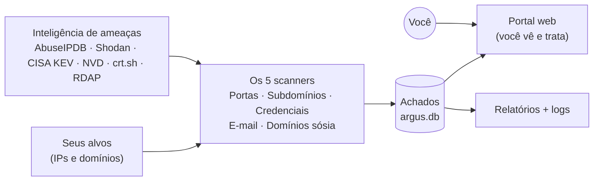
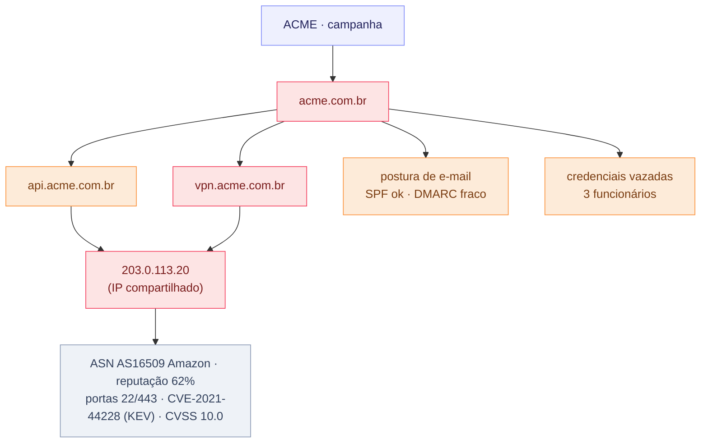

# Argus — Attack Surface Management

<p align="center">
  
</p>

> *O que tudo vê na sua superfície de ataque.*

## O que é?

O Argus é o seu **vigia da superfície de ataque externa**. Ele enxerga a sua
organização como um atacante enxergaria — **de fora, pela internet** — e te mostra
o que está exposto, o quão perigoso é e o que resolver primeiro. Roda no Linux
(Debian/Ubuntu/Kali), sem instalar nada nos seus servidores e sem disparar ataque:
é **observação passiva e inteligente**.

## O que ela faz?

A cada rodada, o Argus procura o que pode te colocar em risco lá fora:

- 🔌 **Portas abertas** — serviços expostos nos seus IPs (banco de dados, RDP, SMB…).
- 🌐 **Subdomínios** — o host esquecido, o ambiente de homologação que escapou pra internet.
- 🔑 **Credenciais vazadas** — logins da empresa achados em vazamentos de infostealer.
- ✉️ **Postura de e-mail** — se o seu domínio pode ser usado em phishing (SPF / DMARC / DKIM).
- 🎭 **Domínios sósia** — domínios parecidos com o seu, prontos pra um golpe.

Cada coisa encontrada vira um **achado** com uma criticidade (Crítico → Info). E
quando você trata um achado, ele **não volta como novo** na rodada seguinte — o Argus
lembra do que já foi resolvido.

A criticidade vem de **evidência, não de chute**: o Argus olha se o ativo está exposto,
se o IP tem má reputação, se existe vulnerabilidade conhecida e se ela **já está sendo
explorada lá fora**. O que é particular da sua empresa — como saber se um host é de
produção ou de testes — fica pra **você validar**; o Argus não adivinha o seu contexto.

## Como funciona?

Você aponta os alvos, os scanners descobrem o que está exposto, a inteligência de
ameaças enriquece — cruzando os CVEs encontrados com a **CISA KEV** (vulnerabilidades
**exploradas in-the-wild**, que ganham um selo **KEV**) e com a **NVD** (a nota **CVSS**
oficial de cada falha) — e tudo vira achado:



Ele roda **sozinho todo dia** (agendado) — e você pode rodar na mão quando quiser.
Os achados aparecem no **portal web** (`https://<host>:8443`, com login) ou na linha
de comando (`argus-finding`), onde você faz a triagem.

### STATUS e ESTADO

O Argus separa **o que o scanner vê** (STATUS, automático) de **o que o analista decide**
(ESTADO, manual) — dois níveis que não se misturam.

**STATUS — detecção (cada scanner decide sozinho):**

| Status | Quando acontece |
|---|---|
| **Novo** | apareceu pela primeira vez. |
| **Reincidente** | rodou de novo e continua lá. |
| **Corrigido** | rodou e não foi mais encontrado (precisa de **3 dias** ausente; nunca vai de Novo direto para Corrigido). |
| **Ressurgido** | estava Corrigido e voltou a aparecer. |

**ESTADO — triagem do achado (você decide no portal):**

| Estado | O que significa | Onde aparece |
|---|---|---|
| **Novo** | ainda não triado. | aba **Backlog** |
| **Em tratamento** | em análise/correção. | aba **Tratado** (continua nos painéis do scanner) |
| **Mitigado** | resolvido. | aba **Tratado** (some dos painéis do scanner) |
| **Falso positivo** | não é risco real. | aba **Tratado** (some dos painéis do scanner) |

O único ponto onde os dois níveis se tocam: quando o scanner marca um item como
**Corrigido**, o achado correspondente vira **Mitigado** automaticamente. O histórico fica
sempre guardado.

## Tudo conectado — o mapa de correlação

Achado solto conta pouco. O que importa é como as coisas se ligam: **um mesmo IP
servindo vários subdomínios** é um ponto único de falha; uma **CVE crítica** nesse IP
vira o raio de explosão de tudo que depende dele. O **mapa de correlação** mostra isso
como um grafo: você clica e expande — campanha → domínios → subdomínios e achados → IPs —
e cada bolinha tem a **cor da sua criticidade**. Clicar em qualquer item abre o que se
sabe dele (o enriquecimento).

Exemplo (dados fictícios): `api` e `vpn` resolvem para o **mesmo IP**, que está exposto
e tem uma CVE explorada:



No exemplo, clicar no IP compartilhado revela a tabelinha de enriquecimento — provedor
(ASN), reputação, portas abertas, CVE/KEV e nota CVSS — e fica claro que **dois serviços
caem juntos** se aquele host for comprometido.

## Como instalar?

No Debian/Ubuntu/**Kali**, como root:

```bash
git clone https://github.com/boliveiras/argus-asm-v1.git
cd argus-asm-v1
sudo bash install.sh
```

O instalador cuida do resto — dependências, comandos, agendamento e o portal web.
Aí é só dizer **o que** monitorar e deixar trabalhar:

```bash
sudo nano /etc/argus/monitor/targets/EMPRESA.txt      # seus IPs
sudo nano /etc/argus/submonitor/targets/EMPRESA.txt   # seus domínios
```

---

<sub>Licença <strong>AGPL-3.0</strong> · © 2026 Bruno Santos · veja <a href="LICENSE">LICENSE</a></sub>
