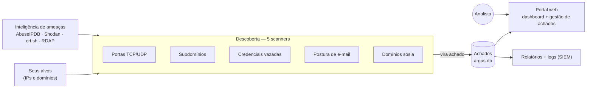
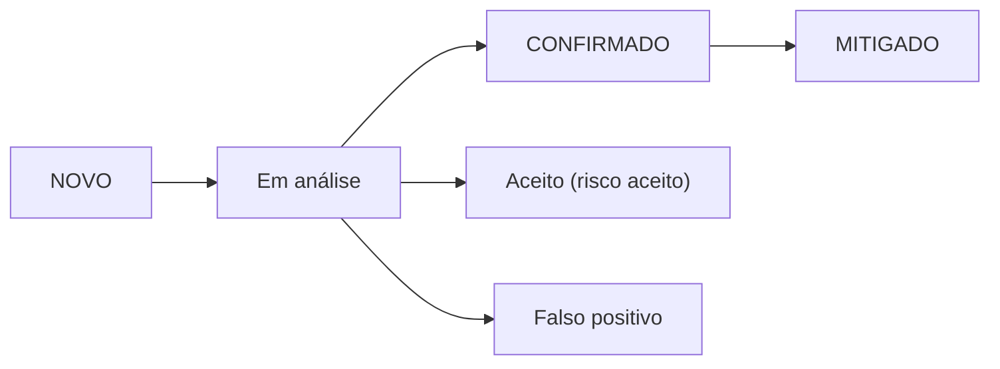

# Argus — Attack Surface Management

<p align="center">
  
</p>

> *O que tudo vê na sua superfície de ataque.* Monitoramento contínuo da superfície
> de ataque **externa** da sua organização.

---

## O que é

O **Argus** descobre o que está **exposto na internet** sobre a sua organização,
classifica o **risco** e mostra **o que tratar primeiro** — sem instalar agentes e
usando apenas inteligência **passiva** (sem ataque ativo).

Ele responde, de forma contínua, a três perguntas:

- **O que eu tenho exposto?** portas, subdomínios, credenciais vazadas, e-mail e domínios sósia.
- **Qual o risco?** cada exposição vira um *achado* classificado (Crítico → Info).
- **O que mudou e o que falta tratar?** um achado já tratado **não volta** como novo.

---

## Como funciona



A cada execução, os scanners **descobrem** os ativos expostos, a inteligência de
ameaças **enriquece** (reputação de IP, CVEs, etc.), tudo é consolidado em **achados**
(`argus.db`) com risco e status, e você **vê e tria** no portal web ou pela linha de
comando.

---

## O que ele encontra

| Scanner | O que procura | Achado típico |
|---|---|---|
| **Portas** | portas TCP/UDP abertas nos seus IPs | banco de dados, RDP, SMB ou serviço exposto |
| **Subdomínios** | subdomínios via DNS, Certificate Transparency e urlscan | host esquecido, ambiente de homologação na internet |
| **Credenciais** | vazamentos de *infostealer* por domínio (Hudson Rock) | credencial corporativa comprometida |
| **E-mail** | SPF / DMARC / DKIM do domínio | domínio sujeito a *spoofing* / phishing |
| **Typosquat** | domínios parecidos com o seu (dnstwist) | domínio sósia pronto para phishing da marca |

Cada achado recebe uma severidade — **Crítico · Alto · Médio · Baixo · Info** — que a
inteligência de ameaças pode **elevar** (IP com má reputação, CVE conhecida), mas
**nunca rebaixa**.

---

## Instalação

Requisitos: Debian/Ubuntu/**Kali**, acesso root e Python 3.10+.

```bash
git clone https://github.com/boliveiras/argus-asm-v1.git
cd argus-asm-v1
sudo bash install.sh
```

O instalador prepara tudo: dependências, comandos `argus-*`, agendamentos (cron),
banco de achados e o portal web em **Apache (HTTPS) com tela de login**.

```bash
sudo bash install.sh --no-apache    # só relatórios locais, sem portal web
sudo bash install.sh --uninstall    # remove comandos, cron e portal (preserva os dados)
```

Defina os alvos (um arquivo `.txt` por empresa/campanha):

```bash
sudo nano /etc/argus/monitor/targets/EMPRESA.txt      # IPs
sudo nano /etc/argus/submonitor/targets/EMPRESA.txt   # domínios
```

> Chaves de API (AbuseIPDB, urlscan) são **opcionais** e melhoram o enriquecimento —
> ficam em `/etc/argus/threatintel/config.json`. Sem elas, o Argus funciona mesmo assim.

---

## O que roda e quando

Cada scanner roda **sozinho** (campanhas independentes) e também **automaticamente**
por cron:

| Comando | O que faz | Quando (automático) |
|---|---|---|
| `argus-monitor` | varre portas **TCP** | diário · 10:00 |
| `argus-monitor --udp` | varre portas **UDP** | domingo · 03:00 |
| `argus-submonitor` | descobre subdomínios | diário · 12:00 |
| `argus-email` | checa postura de e-mail | diário · 13:00 |
| `argus-credentials` | busca credenciais vazadas | diário · 14:00 |
| `argus-typosquat` | acha domínios sósia | domingo · 05:00 |

Você pode rodar qualquer um na mão a qualquer momento. Os de domínio
(`credentials`, `email`, `typosquat`) **reaproveitam** os domínios do submonitor.

---

## Gestão de achados

O coração do Argus: cada exposição é um **achado com identidade própria** em
`argus.db`. A **detecção** (o scanner ainda vê?) é separada da **triagem** (o que a
equipe decidiu) — então um achado tratado **não reaparece como novo** a cada execução.



A triagem é feita pelo **portal web** (página *Gestão de Achados*) ou pela **CLI**:

```bash
argus-finding list                 # backlog priorizado (paginado)
argus-finding show <id>            # detalhe + histórico + evidências
argus-finding set  <id> mitigado --note "corrigido no firewall"
argus-finding counts               # distribuição por severidade/status
```

Cada categoria de achado é mapeada para **ISO 27002 · CIS Controls v8 · PCI-DSS v4**.

---

## O portal web

Acesse `https://<host>:8443/` — uma **tela de login com a identidade Argus** (não o
pop-up padrão do Apache). Lá dentro:

- **Dashboard** — visão consolidada (severidades, tendências, campanhas).
- **Gestão de Achados** — backlog, filtros, triagem, histórico auditável.
- **Relatórios por scanner** — portas, subdomínios, credenciais, e-mail, typosquat.
- **Guia de Risco** — como o risco é calculado + mapeamento de conformidade.

Tudo *offline* (sem CDN), com **tema claro/escuro** e exportação para PDF/CSV. As ações
de gestão são **auditadas** (quem fez, quando) e os scanners emitem **logs RFC 5424**
prontos para SIEM.

---

## Reset e desinstalação

```bash
sudo argus-reset            # recomeça do zero, PRESERVANDO o enriquecimento de Threat Intel
sudo bash install.sh --uninstall    # remove a instalação (mantém os dados em /etc/argus)
```

---

## Licença

**GNU Affero General Public License v3.0 (AGPL-3.0)** — ver [`LICENSE`](LICENSE).
Copyright © 2026 Bruno Santos.
