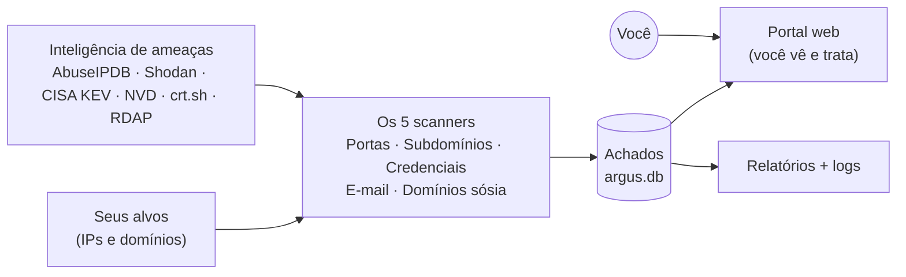
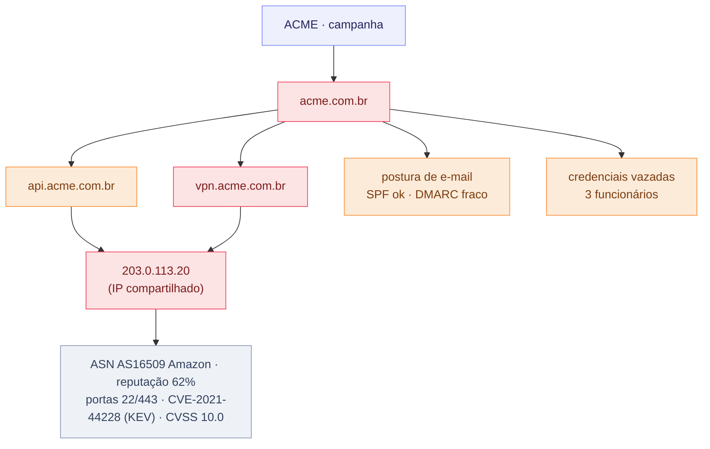

# Argus — Attack Surface Management

<p align="center">
  
</p>

> *O que tudo vê na sua superfície de ataque.*

## O que é?

O Argus é o seu **vigia da superfície de ataque externa**. Ele enxerga a sua
organização como um atacante enxergaria — **de fora, pela internet** — e te mostra
o que está exposto, o quão perigoso é e o que resolver primeiro. Roda no Linux
(Debian/Ubuntu/Kali), sem instalar nada nos seus servidores e sem disparar ataque:
é **observação passiva e inteligente**.

## O que ela faz?

A cada rodada, o Argus procura o que pode te colocar em risco lá fora:

- 🔌 **Portas abertas** — serviços expostos nos seus IPs (banco de dados, RDP, SMB…).
- 🌐 **Subdomínios** — o host esquecido, o ambiente de homologação que escapou pra internet.
- 🔑 **Credenciais vazadas** — logins da empresa achados em vazamentos de infostealer.
- ✉️ **Postura de e-mail** — se o seu domínio pode ser usado em phishing (SPF / DMARC / DKIM).
- 🎭 **Domínios sósia** — domínios parecidos com o seu, prontos pra um golpe.

Cada coisa encontrada vira um **achado** com uma criticidade (Crítico → Info). E
quando você trata um achado, ele **não volta como novo** na rodada seguinte — o Argus
lembra do que já foi resolvido.

A criticidade vem de **evidência, não de chute**: o Argus olha se o ativo está exposto,
se o IP tem má reputação, se existe vulnerabilidade conhecida e se ela **já está sendo
explorada lá fora**. O que é particular da sua empresa — como saber se um host é de
produção ou de testes — fica pra **você validar**; o Argus não adivinha o seu contexto.

## Como funciona?

Você aponta os alvos, os scanners descobrem o que está exposto, a inteligência de
ameaças enriquece — cruzando os CVEs encontrados com a **CISA KEV** (vulnerabilidades
**exploradas in-the-wild**, que ganham um selo **KEV**) e com a **NVD** (a nota **CVSS**
oficial de cada falha) — e tudo vira achado:


```mermaid
flowchart LR
    A["Seus alvos<br/>(IPs e domínios)"] --> SC
    TI["Inteligência de ameaças<br/>AbuseIPDB · Shodan · CISA KEV · NVD · crt.sh · RDAP"] --> SC
    SC["Os 5 scanners<br/>Portas · Subdomínios · Credenciais<br/>E-mail · Domínios sósia"] --> DB[("Achados<br/>argus.db")]
    DB --> P["Portal web<br/>(você vê e trata)"]
    DB --> R["Relatórios + logs"]
    U(("Você")) --> P
```

Ele roda **sozinho todo dia** (agendado) — e você pode rodar na mão quando quiser.
Os achados aparecem no **portal web** (`https://<host>:8443`, com login) ou na linha
de comando (`argus-finding`), onde você faz a triagem.

### STATUS e ESTADO

O Argus separa **o que o scanner vê** (STATUS, automático) de **o que o analista decide**
(ESTADO, manual) — dois níveis que não se misturam.

**STATUS — detecção (cada scanner decide sozinho):**

| Status | Quando acontece |
|---|---|
| **Novo** | apareceu pela primeira vez. |
| **Reincidente** | rodou de novo e continua lá. |
| **Corrigido** | rodou e não foi mais encontrado (precisa de **3 dias** ausente; nunca vai de Novo direto para Corrigido). |
| **Ressurgido** | estava Corrigido e voltou a aparecer. |

**ESTADO — triagem do achado (você decide no portal):**

| Estado | O que significa | Onde aparece |
|---|---|---|
| **Novo** | ainda não triado. | aba **Backlog** |
| **Em tratamento** | em análise/correção. | aba **Tratado** (continua nos painéis do scanner) |
| **Mitigado** | resolvido. | aba **Tratado** (some dos painéis do scanner) |
| **Falso positivo** | não é risco real. | aba **Tratado** (some dos painéis do scanner) |

Os dois níveis **não se misturam**: o scanner nunca muda a sua triagem. Se um achado
some de uma varredura, ele apenas deixa de ser observado — e volta a aparecer se
reaparecer. **Mitigado e Falso positivo são decisão sua**, ninguém marca por você. Isso
evita a gangorra clássica: uma falha de rede fazia o item "sumir", virar mitigado sozinho
e voltar como novo na rodada seguinte. O histórico fica sempre guardado.

## Tudo conectado — o mapa de correlação

Achado solto conta pouco. O que importa é como as coisas se ligam: **um mesmo IP
servindo vários subdomínios** é um ponto único de falha; uma **CVE crítica** nesse IP
vira o raio de explosão de tudo que depende dele. O **mapa de correlação** mostra isso
como um grafo: você clica e expande — campanha → domínios → subdomínios e achados → IPs —
e cada bolinha tem a **cor da sua criticidade**. Clicar em qualquer item abre o que se
sabe dele (o enriquecimento).

Exemplo (dados fictícios): `api` e `vpn` resolvem para o **mesmo IP**, que está exposto
e tem uma CVE explorada:


```mermaid
flowchart TD
    C["ACME · campanha"]:::camp --> D["acme.com.br"]:::crit
    D --> S2["api.acme.com.br"]:::alto
    D --> S3["vpn.acme.com.br"]:::crit
    D --> EM["postura de e-mail<br/>SPF ok · DMARC fraco"]:::alto
    D --> CR["credenciais vazadas<br/>3 funcionários"]:::alto
    S2 --> IP["203.0.113.20<br/>(IP compartilhado)"]:::crit
    S3 --> IP
    IP --> E["ASN AS16509 Amazon · reputação 62%<br/>portas 22/443 · CVE-2021-44228 (KEV) · CVSS 10.0"]:::info

    classDef camp fill:#eef0fe,stroke:#818cf8,color:#23235c
    classDef crit fill:#fde4e4,stroke:#f43f5e,color:#7a1d1d
    classDef alto fill:#fdebd9,stroke:#fb923c,color:#7a3d12
    classDef info fill:#eef2f7,stroke:#8a99b4,color:#33415c
```

No exemplo, clicar no IP compartilhado revela a tabelinha de enriquecimento — provedor
(ASN), reputação, portas abertas, CVE/KEV e nota CVSS — e fica claro que **dois serviços
caem juntos** se aquele host for comprometido.

O mapa também **inverte a leitura**: na visão **“Por IP”** o grafo fica
`campanha → domínio → IP → subdomínios`, mostrando de cara **quais IPs concentram mais
serviços** — é por onde começa quem quer priorizar infraestrutura. Dá para **filtrar por
criticidade** (ver só o que é crítico e alto), **dar zoom** e, ao clicar num item, acender
só ele e o que está ligado a ele — o resto esmaece.

## Tudo pela web

Depois de instalado, você não precisa mais editar arquivo no servidor para operar:

| Na tela | O que dá para fazer |
|---|---|
| **Campanhas** | Cadastrar, editar, renomear e excluir os alvos — IPs/faixas (portas) e domínios (subdomínios). Renomear **leva o histórico junto**; excluir só tira do escopo e **preserva os achados**. |
| **Wordlist** | Editar os prefixos usados na descoberta de subdomínios (`api`, `vpn`, `abt.cleverdata`…). Já vem com **100 prefixos** prontos e nunca aceita ficar vazia. |
| **▶ Executar agora** | Roda a sequência completa na hora, sem esperar o agendamento, com **barra de progresso** etapa a etapa. Um de cada vez: enquanto roda, o botão fica travado. |
| **Usuários** | Contas de acesso e perfis (veja abaixo). |

### Quem pode o quê

| Perfil | Pode |
|---|---|
| **Administrador** | é o usuário criado na instalação. Faz tudo, e é o **único** que gerencia contas. |
| **Master** | leitura + edição: campanhas, wordlist, executar scans e triagem de achados. |
| **User** | **somente leitura** — consulta tudo, não altera nada (os botões de edição nem aparecem). |

Cada um troca a própria senha informando a atual; o administrador redefine a de qualquer
um. As senhas são guardadas apenas como **hash bcrypt** e toda ação em contas fica na
trilha de auditoria.

### Relatórios do seu jeito

As tabelas abrem com as **colunas essenciais** para a triagem. O resto do enriquecimento
(ISP, CVEs, DNSSEC, SSL, WHOIS, reputação…) continua ali, a um clique em **Colunas** — e a
sua escolha fica salva para as próximas visitas.

## Como instalar?

No Debian/Ubuntu/**Kali**, como root:

```bash
git clone https://github.com/boliveiras/argus-asm-v1.git
cd argus-asm-v1
sudo bash install.sh
```

O instalador cuida do resto — dependências, comandos, agendamento, o portal web e o
usuário administrador (você define a senha na instalação).

Aí é só abrir `https://<host>:8443`, entrar em **Campanhas**, cadastrar seus IPs e
domínios e clicar em **▶ Rodar todos os scans agora**. Daí em diante ele roda sozinho
todo dia.

Se preferir o terminal, os alvos continuam sendo arquivos simples:

```bash
sudo nano /etc/argus/monitor/targets/EMPRESA.txt      # seus IPs
sudo nano /etc/argus/submonitor/targets/EMPRESA.txt   # seus domínios
```

---

<sub>Licença <strong>AGPL-3.0</strong> · © 2026 Bruno Santos · veja <a href="LICENSE">LICENSE</a></sub>
