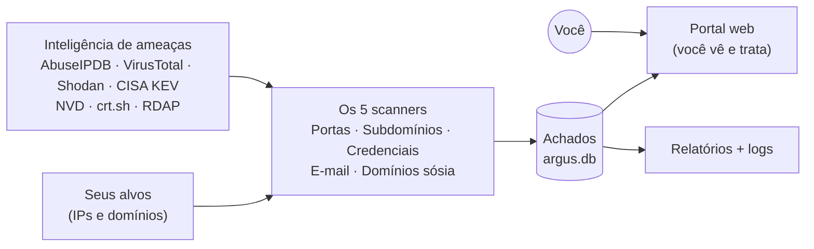
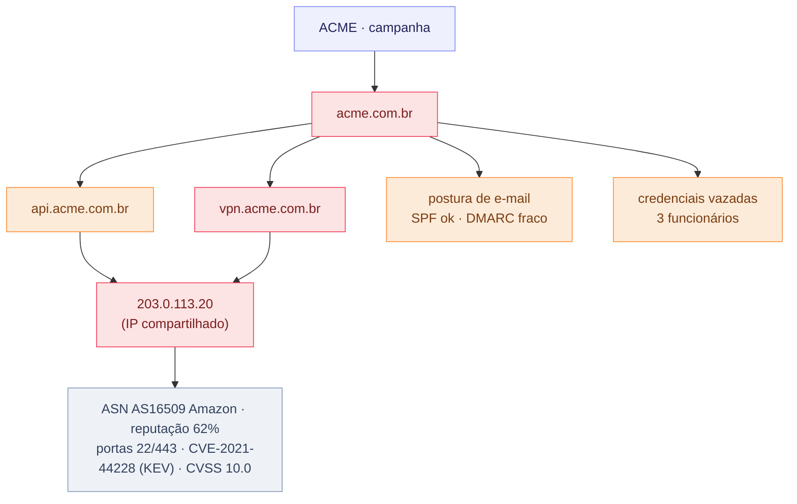

# Argus — Attack Surface Management

<p align="center">
  
</p>

> *O que tudo vê na sua superfície de ataque.*

## O que é?

O Argus é o seu **vigia da superfície de ataque externa**. Ele enxerga a sua
organização como um atacante enxergaria — **de fora, pela internet** — e te mostra o
que está exposto, o quão perigoso é e o que resolver primeiro.

Roda no Linux (Debian/Ubuntu/Kali), sem instalar nada nos seus servidores e sem
disparar ataque: é **observação passiva**.

## O que ela faz?

A cada rodada, procura o que pode te colocar em risco lá fora:

- 🔌 **Portas abertas** — serviços expostos nos seus IPs (banco de dados, RDP, SMB…).
- 🌐 **Subdomínios** — o host esquecido, a homologação que escapou para a internet.
- 🔑 **Credenciais vazadas** — logins da empresa em vazamentos de infostealer.
- ✉️ **Postura de e-mail** — se dá para mandar phishing em nome do seu domínio.
- 🎭 **Domínios sósia** — domínios parecidos com o seu, já registrados.

Cada coisa encontrada vira um **achado** com uma criticidade. Quando você trata um
achado, ele **não volta como novo** na rodada seguinte.

A criticidade vem de **evidência, não de chute**: o Argus olha se o ativo está
exposto, se o IP tem má reputação, se existe vulnerabilidade conhecida e se ela **já
está sendo explorada lá fora**. O que é particular da sua empresa — como saber se um
host é de produção ou de testes — fica para **você** validar.

## Como funciona?

Você aponta os alvos, os scanners descobrem o que está exposto, a inteligência de
ameaças enriquece, e tudo vira achado:


```mermaid
flowchart LR
    A["Seus alvos<br/>(IPs e domínios)"] --> SC
    TI["Inteligência de ameaças<br/>AbuseIPDB · VirusTotal · Shodan · CISA KEV<br/>NVD · crt.sh · RDAP"] --> SC
    SC["Os 5 scanners<br/>Portas · Subdomínios · Credenciais<br/>E-mail · Domínios sósia"] --> DB[("Achados<br/>argus.db")]
    DB --> P["Portal web<br/>(você vê e trata)"]
    DB --> R["Relatórios + logs"]
    U(("Você")) --> P
```

Ele roda **sozinho todo dia** — e você dispara na hora quando quiser.

Duas informações andam separadas em cada achado: **o que o scanner vê** (apareceu,
continua lá, sumiu) e **o que você decidiu** (em tratamento, mitigado, falso
positivo). O scanner nunca mexe na sua decisão. É o que evita a gangorra clássica:
uma falha de rede fazia o item sumir, virar "resolvido" sozinho e voltar como novo
no dia seguinte.

## Tudo conectado — o mapa de correlação

Achado solto conta pouco. O que importa é como as coisas se ligam: **um mesmo IP
servindo vários subdomínios** é um ponto único de falha; uma CVE crítica nesse IP
vira o raio de explosão de tudo que depende dele.

Exemplo (dados fictícios): `api` e `vpn` resolvem para o **mesmo IP**, que está
exposto e tem uma CVE explorada:


```mermaid
flowchart TD
    C["ACME · campanha"]:::camp --> D["acme.com.br"]:::crit
    D --> S2["api.acme.com.br"]:::alto
    D --> S3["vpn.acme.com.br"]:::crit
    D --> EM["postura de e-mail<br/>SPF ok · DMARC fraco"]:::alto
    D --> CR["credenciais vazadas<br/>3 funcionários"]:::alto
    S2 --> IP["203.0.113.20<br/>(IP compartilhado)"]:::crit
    S3 --> IP
    IP --> E["ASN AS16509 Amazon · reputação 62%<br/>portas 22/443 · CVE-2021-44228 (KEV) · CVSS 10.0"]:::info

    classDef camp fill:#eef0fe,stroke:#818cf8,color:#23235c
    classDef crit fill:#fde4e4,stroke:#f43f5e,color:#7a1d1d
    classDef alto fill:#fdebd9,stroke:#fb923c,color:#7a3d12
    classDef info fill:#eef2f7,stroke:#8a99b4,color:#33415c
```

Fica claro que **dois serviços caem juntos** se aquele host for comprometido.

## Levar os logs para fora

O Argus costuma rodar longe de quem o acompanha — numa VPS, de propósito, para
enxergar a empresa como um estranho enxerga. O **Logpush** manda o que ele registra
para onde você já olha.

Para um **bucket S3**, cada evento vira um arquivo, pronto para o SIEM consumir — e
antes do primeiro envio o Argus exige uma **prova de posse** do bucket: grava um token,
você o lê no bucket e cola de volta. Dado sensível não vai para bucket que você não
controla. A chave só precisa de `s3:PutObject` no prefixo (`logs/*`). Para um
**chat** (Google Chat, Slack,
Discord, Teams, Telegram), vira uma mensagem que dá para ler:

> 🔴 CRÍTICO · Nova porta exposta
> campanha: ACME · ip: 203.0.113.20 · port: 3389
> 15/08/2026 13:35

Os logs continuam na máquina; o que vai para fora é uma cópia. Se o destino cair,
nada se perde: o envio recomeça de onde parou.

## Tudo pela web

Depois de instalado, você não precisa editar arquivo no servidor para operar:

| Na tela | O que dá para fazer |
|---|---|
| **Campanhas** | Cadastrar e editar o escopo — IPs (portas) e domínios (subdomínios). Renomear leva o histórico junto; excluir preserva os achados. |
| **▶ Rodar agora** | Roda a sequência completa na hora, com progresso etapa a etapa. Dá para limitar a uma campanha. |
| **Gestão de Achados** | A triagem: estado, nota e evidência, com trilha de auditoria. |
| **Correlação** | O mapa do que está ligado a quê. |
| **Fontes** | Ligar/desligar cada fonte de inteligência e guardar as chaves de API. |
| **Logpush** | Enviar os logs para um bucket ou para um chat. |
| **Usuários** | Contas e perfis: administrador, master (edita) e user (só lê). |
| **?** | A documentação completa, num painel lateral — já na seção da tela em que você está. |

As tabelas abrem com as **colunas essenciais**; o resto do enriquecimento fica a um
clique em **Colunas**, e a sua escolha é lembrada.

O rodapé mostra a versão em execução, e **`/version`** responde em JSON com versão,
commit e data da instalação — dá para conferir numa requisição se o que está no ar é
o último commit.

## Como instalar?

No Debian/Ubuntu/**Kali**, como root:

```bash
git clone https://github.com/boliveiras/argus-asm-v1.git
cd argus-asm-v1
sudo bash install.sh
```

O instalador cuida do resto — dependências, comandos, agendamento, o portal e o
usuário administrador. Ele não pergunta senha: gera uma e **mostra ao final, na
tela** (não vai para log nenhum). No primeiro acesso o portal exige a troca, e até
lá a conta não abre mais nada — se alguém vir a senha por cima do seu ombro, ela
não serve para ler os achados. Reinstalar não mexe na senha que você já trocou.
Ele mostra o progresso e o que exige atenção; o detalhe fica em
`/var/log/argus-install.log`, e `--verbose` traz tudo para a tela.

Os serviços rodam com uma conta própria (`argus`), **sem shell e sem login** — o que
expõe serviço na rede não carrega os privilégios de quem administra a máquina. Quem
instalou entra no grupo `argus` e continua podendo rodar os scanners na mão.

Depois: abra `https://<host>:8443`, entre em **Campanhas**, cadastre seus IPs e
domínios e clique em **▶ Rodar agora**. Daí em diante ele roda sozinho.

Se preferir o terminal, os alvos continuam sendo arquivos simples:

```bash
sudo nano /etc/argus/monitor/targets/EMPRESA.txt      # seus IPs
sudo nano /etc/argus/submonitor/targets/EMPRESA.txt   # seus domínios
```

---

<sub>Licença <strong>AGPL-3.0</strong> · © 2026 Bruno Santos · veja <a href="LICENSE">LICENSE</a></sub>
